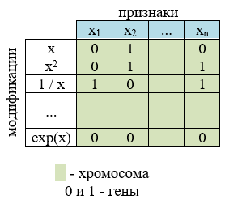
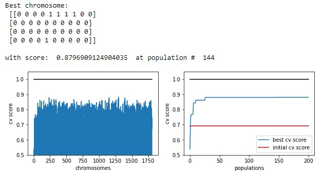

## Генетический алгоритм для поиска и создания информативных признаков

Информационное видео по алгоритму на моём YouTube канале.

[](https://www.youtube.com/watch?v=HXheAwbO8fk)

## Идея

- Модификацию признаков представим в виде матрицы. Матрицу называют хромосомой. Она заполняется нулями и единицами - это гены. 0 - не выполнять данную модификацию над признаком, 1 - выполнять модификацию.



- Из нескольких хромосом составляют популяцию (поколение). Хромосомы нулевого поколения заполняют единицами и нулями случайным образом.
- По каждой хромосоме создается свой набор измененных данных, обучается модель и определяется её качество с использованием скользящего контроля. В алгоритм встроены следующие модели машинного обучения - **KNN** и **Random Forest**
- Следующий набор хромосом (следующее поколение) создаётся путём копирования части ген из хромосомы с самой высокой точностью модели в хромосомы моделей меньшей точности (скрещивание).

```
{'genes': array([[0, 1, 1, 0, 0, 0, 0, 1, 0, 1],
                 [1, 0, 1, 1, 0, 0, 1, 0, 1, 0],
                 [1, 0, 0, 1, 0, 0, 0, 0, 0, 1],
                 [1, 1, 1, 0, 0, 0, 1, 0, 1, 0]]), 'cv_score': 0.833}, 
                 
{'genes': array([[0, 1, 0, 0, 1, 0, 1, 1, 0, 1],
                 [0, 1, 1, 1, 0, 0, 0, 1, 1, 1],
                 [1, 1, 0, 1, 0, 0, 1, 1, 1, 1],
                 [0, 1, 1, 1, 0, 1, 1, 0, 1, 1]]), 'cv_score': 0.793}, 
                 
{'genes': array([[0, 0, 1, 0, 1, 1, 1, 1, 0, 0],
                 [1, 1, 0, 0, 1, 0, 0, 1, 1, 0],
                 [0, 0, 0, 0, 0, 0, 0, 1, 1, 1],
                 [1, 1, 1, 0, 1, 1, 0, 1, 0, 0]]), 'cv_score': 0.773},
                 
                 ...
                 
{'genes': array([[0, 0, 1, 1, 0, 0, 0, 1, 1, 0],
                 [0, 1, 0, 0, 1, 1, 0, 1, 1, 0],
                 [0, 1, 0, 0, 1, 0, 0, 1, 1, 1],
                 [1, 0, 1, 0, 1, 0, 0, 1, 1, 1]]), 'cv_score': 0.745}
```

Если после этого сразу перейти к созданию новых наборов данных и обучению моделей, то через несколько поколений хромосомы начнут повторяться и мы не сможем найти оптимум. Поэтому:
- Случайным генам в хромосомах меняем значение на противоположное, т.е. делаем мутацию.

Для обеспечения мультистарта и выхода из локального минимума:
- Несколько хромосом по прежнему заполняем случайным образом.
- Одну из хромосом генерируем реверсом наилучшей.

Условия остановки:
- Максимальное число поколений (итераций).
- Желаемый уровень качества модели (desired score).

Получив и проанализировав полученные результаты можно выполнить горячий рестарт с изменением некоторых параметров поиска, добавив итерации:
- Увеличить долю мутирующих генов.
- Изменить тип манипуляций над признаками.

## Результаты 

На выходе получаем наилучшую хромосому и историю изменения качества модели по популяциям.

